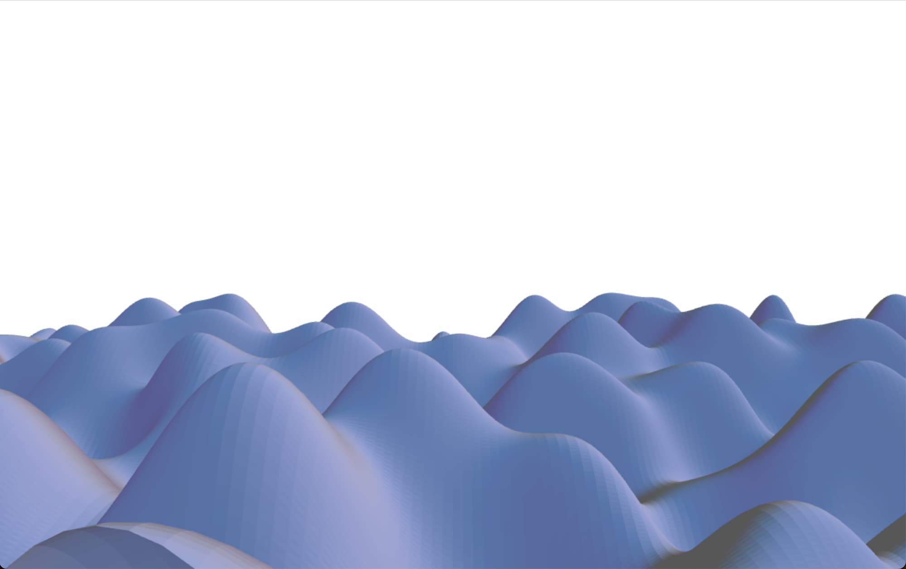
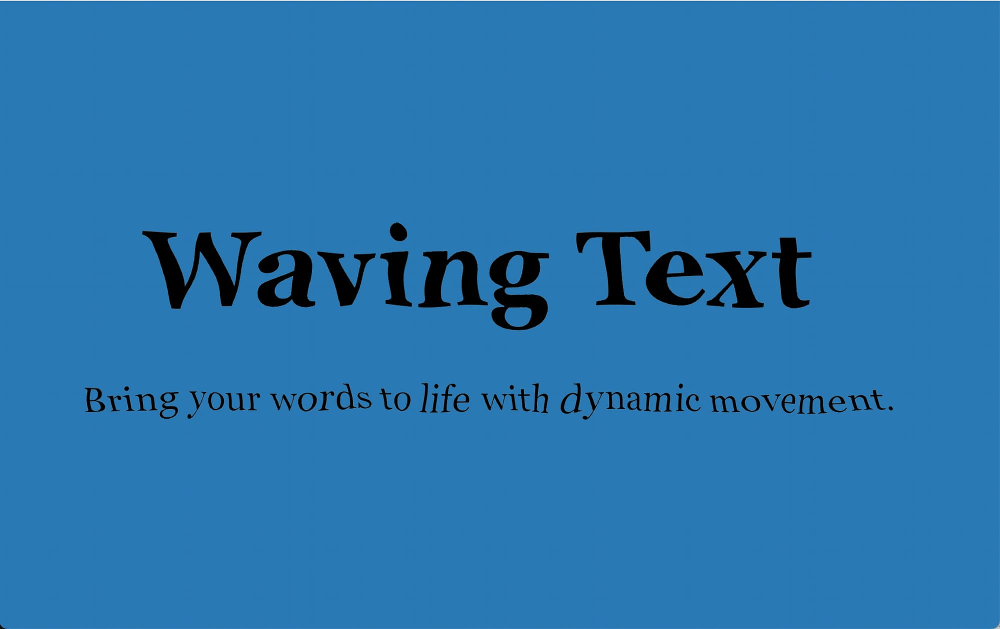
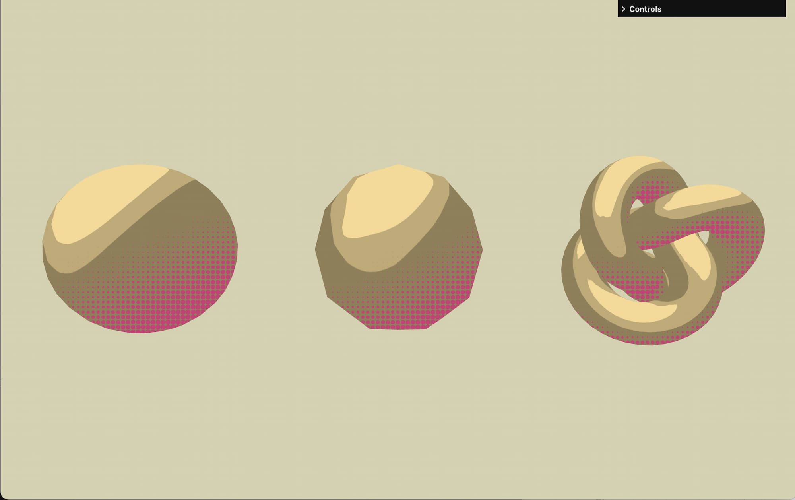
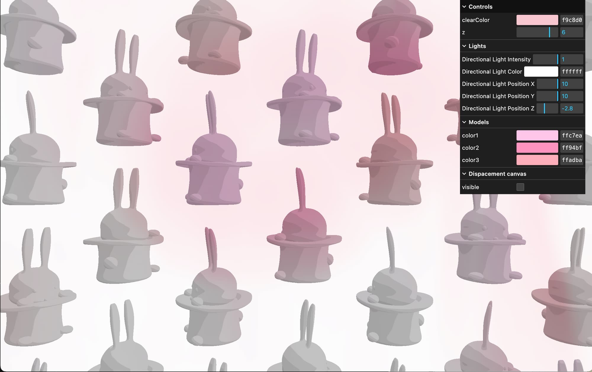
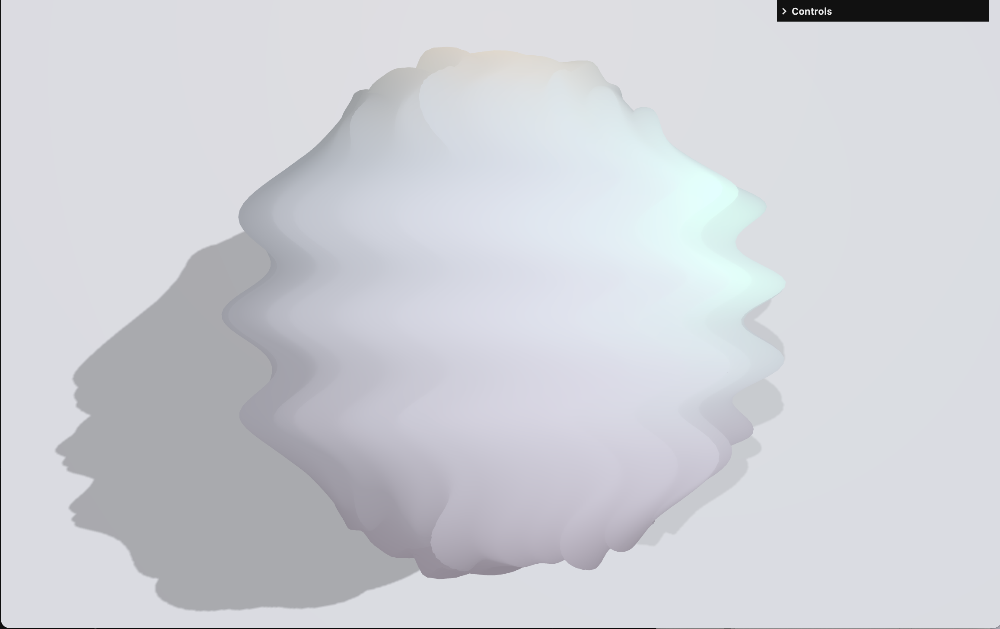
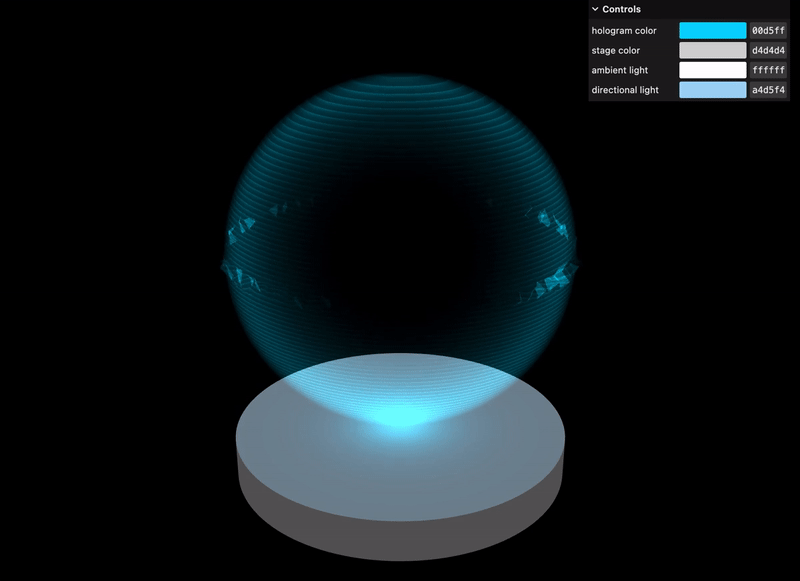
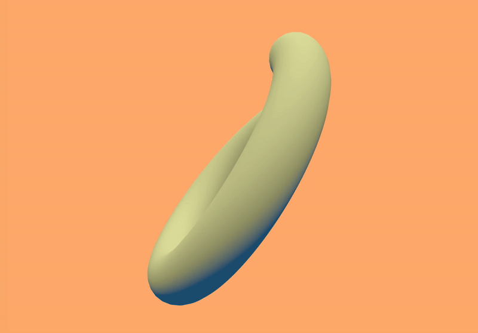
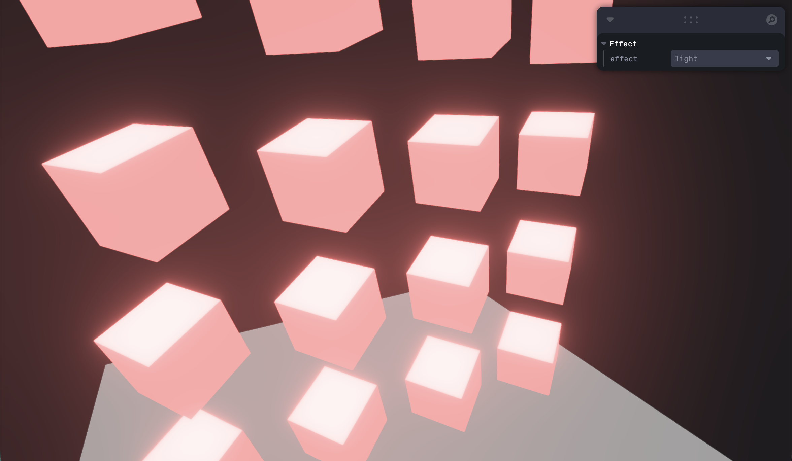

# experiment

- Personal experiment projects
- Basically using Three.js and shaders

### 04 Interactive background

[04_interactive-background](./04_interactive-background)

[Live](https://experiment-04-interactive-background-nrwurzzzg.vercel.app)

### 07 Wave text

[07_wave-text](./07_wave-text)

[Live](https://experiment-07-wave-text.vercel.app)

### 08 Grid glitch

[08_grid-glitch](./08_grid-glitch)

[Live](https://experiment-08-grid-glitch.vercel.app)

### 09 Toonshading

[09_toonshading](./09_toonshading)

[Live](https://experiment-09-toonshading.vercel.app)

### 10 Raycast color

[10_raycast-color](./10_raycast-color)

[Live](https://experiment-10-raycast-color.vercel.app)

### 11 Particles

[11_particles](./11_particles)

[Live](https://experiment-11-particles.vercel.app)

### 12 Particle gpgpu

[Live](https://experiment-12-particle-gpgpu.vercel.app)

🚧

### 13 Geometry transform

[13_geometry-transform](./13_geometry-transform)

[Live](https://experiment-13-geometry-transform.vercel.app)

### 14 Hologram

[14_hologram](./14_hologram)

[Live](https://experiment-14-hologram.vercel.app)

### 15 Line shadow

[15_line-shadow](./15_line-shadow)

[Live](https://experiment-15-line-shadow.vercel.app)

### 16 3D Blob

[16_3d-blob](./16_3d-blob)

🚧

### 17 Postprocess

[17_postprocess](./17_postprocess)

[Live](https://experiment-17-postprocess.vercel.app)

### 18 Model boxing

[18_model-boxing](./18_model-boxing)

[Live](https://experiment-18-model-boxing.vercel.app)

